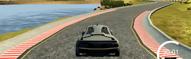
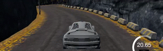
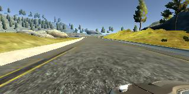
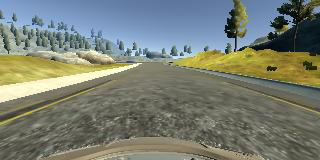
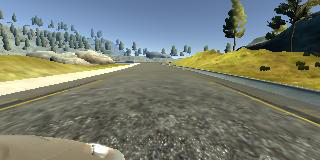
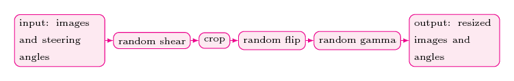
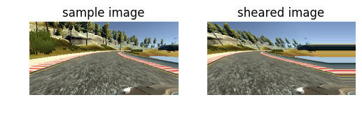
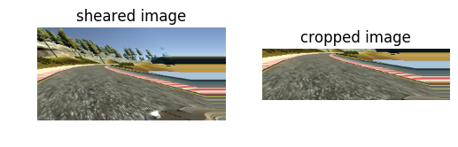
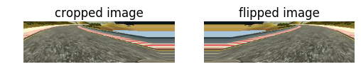
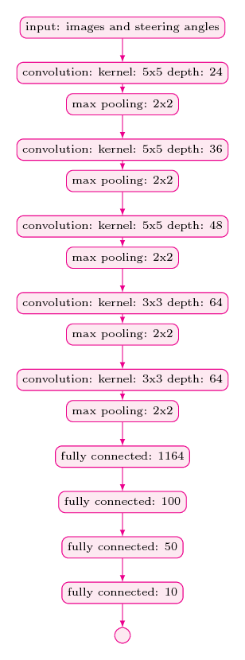

# Self-Driving Car Engineer Nanodegree
# Deep Learning
## Behavioral Cloning: Navigating a Car in a Simulator

### Overview

The objective of this project is to clone human driving behavior using a Deep Neural Network. In order to achieve this, we are going to use a simple Car Simulator. During the training phase, we navigate our car inside the simulator using the keyboard. While we navigating the car the simulator records training images and respective steering angles. Then we use those recorded data to train our neural network. Trained model was tested on two tracks, namely training track and validation track. Following two animations show the performance of our final model in both training and validation tracks.

Training | Validation
------------|---------------
 | 

### Dependencies

This project requires **Python 3.5** and the following Python libraries installed:

- [Keras](https://keras.io/)
- [NumPy](http://www.numpy.org/)
- [SciPy](https://www.scipy.org/)
- [TensorFlow](http://tensorflow.org)
- [Pandas](http://pandas.pydata.org/)
- [OpenCV](http://opencv.org/)
- [Matplotlib](http://matplotlib.org/) (Optional)
- [Jupyter](http://jupyter.org/) (Optional)

Run this command at the terminal prompt to install [OpenCV](http://opencv.org/). Useful for image processing:

- `conda install -c https://conda.anaconda.org/menpo opencv3`

### How to Run the Model

This repository comes with trained model which you can directly test using the following command.

- `python drive.py model.json`

## Implementation

### Data Capturing

During the training, the simulator captures data with a frequency of 10hz. Also, at a given time step it recorded three images taken from left, center, and right cameras. The following figure shows an example I have collected during the training time.

Left| Center | Right
----|--------|-------
 |  | 

Collected data are processed before feeding into the deep neural network and those preprocessing steps are described in the latter part of this file. 

### Dataset Statistics
The dataset consists of 24108 images (8036 images per camera angle). The training track contains a lot of shallow turns and straight road segments. Hence, the majority of the recorded steering angles are zeros. Therefore, preprocessing images and respective steering angles are necessary in order to generalize the training model for unseen tracks such as our validation track.

Next, we are going explain our data processing pipeline.

### Data Processing Pipeline
The following figure shows our data preprocessing pipeline.

 

In the very first state of the pipeline, we apply random shear operation. However, we select images with 0.9 probability for the random shearing process. We kept 10 percent of original images and steering angles in order to help the car to navigate in the training track. The following figure shows the result of shearing operation applied to a sample image.

 

The images captured by the simulator come with a lot of details which do not directly help model building process.  In addition to that extra space occupied by these details required additional processing power. Hence, we remove 35 percent of the original image from the top and 10 percent. This process was done in crop stage. The following figure shows the result of cropping operation applied to an image.

 

The next stage of the data processing pipeline is called random flip stage. In this stage we randomly (with 0.5 probability) flip images. The idea behind this operation is left turning bends are more prevalent than right bends in the training track. Hence, in order to increase the generalization of our mode, we flip images and respective steering angles. The following figure shows the result of flipping operation applied to an image.

 

In the final state of the pipeline, we resize images to 64x64 in order to reduce training time. A sample resized image is shown in the following figure. Resized images are fed into the neural network. The following figure shows the result of resize operation applied to an image.

 

Next we are going to discuss our neural network architecture.

### Network Architecture 

Our convolutional neural network architecture was inspired by NVIDIA's End to End Learning for Self-Driving Cars paper. The main difference between our model and the NVIDIA mode is than we did use MaxPooling layers just after each  Convolutional Layer in order to cut down training time. For more details about our network architecture please refer following figure.

 

### Training
Even after cropping and resizing training images (with all augmented images), training dataset was very large and it could not fit into the main memory. Hence, we used `fit_generator` API of the Keras library for training our model.

We created two generators namely:
* `train_gen = helper.generate_next_batch()`
* `validation_gen = helper.generate_next_batch()` 

Batch size of both `train_gen` and `validation_gen` was 64. We used 20032 images per training epoch. It is to be noted that these images are generated on the fly using the document processing pipeline described above. In addition to that, we used 6400 images (also generated on the fly) for validation. We used `Adam` optimizer with `1e-4` learning rate. Finally, when it comes to the number of training epochs we tried several possibilities such as `5`, `8`, `1`0, `2`5 and `50`. However, `8` works well on both training and validation tracks. 

## Results
In the initial stage of the project, I used a dataset generated by myself. That dataset was small and recorded while navigating the car using the laptop keyboard. However, the model built using that dataset was not good enough to autonomously navigate the car in the simulator. However, later I used the dataset published by the Udacity. The model developed using that dataset (with the help of augmented data) works well on both tracks as shown in following videos. 

#### Training Track

#### Validation Track

## Conclusions and Future Directions
In this project, we were working on a regression problem in the context of self-driving cars. In the initial phase, we mainly focused on finding a suitable network architecture and trained a model using our own dataset. According to Mean Square Error (**MSE**) our model worked well. However, it didn't perform as expected when we test the model using the simulator. So it was a clear indication that MSE is not a good metrics to assess the performance this project. 

In the next phase of the project, we started to use a new dataset (actually, it was the dataset published by Udacity). Additionally, we didn't fully rely on MSE when building our final model. Also, we use relatively small number of training epochs (namely `8` epochs). Data augmentation and new dataset work surprisingly well and our final model showed superb performance on both tracks. 

When it comes to extensions and future directions, I would like to highlight followings.

* Train a model in real road conditions. For this, we might need to find a new simulator.
* Experiment with other possible data augmentation techniques.
* When we are driving a car, our actions such as changing steering angles and applying brakes are not just based on instantaneous driving decisions. In fact, curent driving decision is based on what was traffic/road condition in fast few seconds. Hence, it would be really interesting to seee how Recurrent Neural Network (**RNN**) model such as **LSTM** and **GRU** perform this problem.
* Finally, training a (deep) reinforcement agent would also be an interesting additional project.
